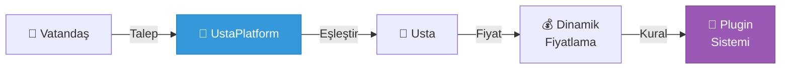
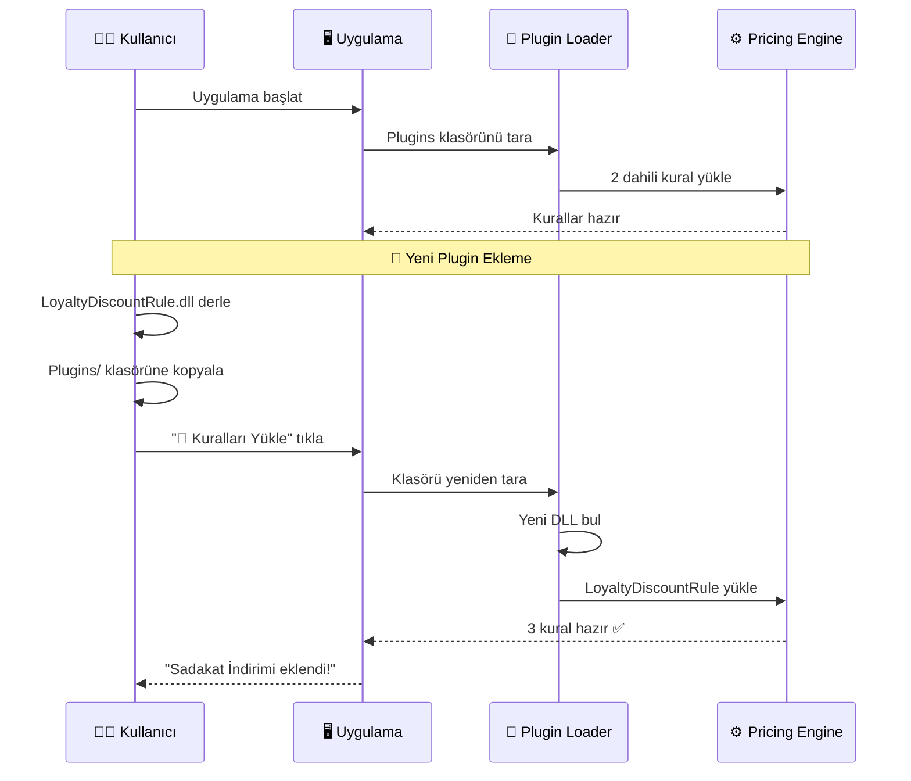

<div align="center">

# 🔧 UstaPlatform

### Arcadia Şehir Uzman Platformu

*Modern, Genişletilebilir ve Akıllı Uzman Eşleştirme Sistemi*

[](https://dotnet.microsoft.com/)
[](https://docs.microsoft.com/en-us/dotnet/csharp/)
[](https://www.microsoft.com/windows)
[](LICENSE)

[Özellikler](#-özellikler) • [Kurulum](#-kurulum) • [Kullanım](#-kullanım) • [Mimari](#-mimari) • [Katkıda Bulunma](#-katkıda-bulunma)

</div>

---

## 📖 Proje Hakkında

**UstaPlatform**, Arcadia şehrindeki kayıp uzmanları (Tesisatçı, Elektrikçi, Marangoz vb.) vatandaş talepleriyle eşleştiren, **dinamik fiyatlama** ve **akıllı rota planlama** yapabilen, genişletilebilir ve modern bir masaüstü uygulamasıdır.

<div align="center">

### 🎯 Neden UstaPlatform?

| 🔌 **Plug-in Mimarisi** | 💰 **Dinamik Fiyatlama** | 🗺️ **Akıllı Eşleştirme** | 🎨 **Modern UI** |
|:---:|:---:|:---:|:---:|
| Kod değiştirmeden genişletilebilir | Özelleştirilebilir fiyat kuralları | Optimum usta seçimi | Kullanıcı dostu arayüz |

</div>

### 🎓 Eğitim Projesi

Bu proje, **Nesne Yönelimli Programlama (NYP)** ve **İleri C#** dersinin ana projesi olup, aşağıdaki konuları kapsamaktadır:

<table>
<tr>
<td width="50%">

#### 🏗️ Yazılım Mühendisliği
- ✅ **SOLID Prensipleri**
- ✅ **Design Patterns**
- ✅ **Plug-in Architecture**
- ✅ **Dependency Injection**

</td>
<td width="50%">

#### 💻 İleri C# Özellikleri
- ✅ **init-only Properties**
- ✅ **Indexer Kullanımı**
- ✅ **IEnumerable<T>**
- ✅ **Object Initializers**

</td>
</tr>
</table>

---

## ✨ Özellikler

<div align="center">



</div>

### 🎯 Ana Özellikler

| Özellik | Açıklama |
|---------|----------|
| 🔌 **Plug-in Sistemi** | Kod değiştirmeden yeni fiyat kuralları eklenebilir |
| 💰 **Dinamik Fiyatlama** | Hafta sonu, acil durum gibi kriterlere göre otomatik fiyatlama |
| 🗺️ **Akıllı Eşleştirme** | Usta yükü, konum ve uzmanlık bazlı optimum eşleştirme |
| 📊 **Anlık Veri Yansıması** | BindingList ile otomatik UI güncellemesi |
| 🎨 **Modern Arayüz** | Kullanıcı dostu, renkli ve responsive tasarım |
| 📅 **Çizelge Yönetimi** | Usta iş programlarını takip ve yönetim |

---

## 🚀 Kurulum

### 📋 Gereksinimler

```bash
.NET 8.0 SDK veya üzeri
Windows 10/11
Visual Studio 2022 (önerilen) veya VS Code
```

### ⚡ Hızlı Başlangıç

```bash
# 1. Projeyi klonlayın
git clone https://github.com/mehmet-karataslar/UstaPlatform.git
cd UstaPlatform

# 2. Projeyi derleyin
dotnet build

# 3. Uygulamayı çalıştırın
dotnet run
```

### 🎨 Visual Studio ile Çalıştırma

1. `UstaPlatform.sln` dosyasını Visual Studio ile açın
2. `F5` tuşuna basarak çalıştırın
3. Uygulamayı keşfetmeye başlayın! 🎉

---

## 📱 Kullanım

### 1️⃣ Usta Ekleme

```csharp
// Örnek: Yeni bir usta ekleyin
Ad: Ahmet Yılmaz
Uzmanlık: Tesisatçı
Telefon: 0555 123 4567
Başlangıç: X:10, Y:20
```

### 2️⃣ Vatandaş ve Talep Oluşturma

```csharp
// Vatandaş ekle
Ad: Mehmet Demir
Adres: X:15, Y:25

// Talep oluştur
Vatandaş: Mehmet Demir
Uzmanlık: Tesisatçı
Acil: ✅
```

### 3️⃣ Eşleştirme ve İş Atama

1. **Eşleştir** butonuna tıklayın
2. Sistem en uygun ustayı bulacak
3. Dinamik fiyat hesaplanacak
4. **İşi Ata** ile onaylayın

---

## 🏗️ Mimari

### 📐 Katmanlı Mimari

<div align="center">

```
┌─────────────────────────────────────────┐
│         🎨 Presentation Layer           │
│            (WinForms UI)                │
└─────────────────┬───────────────────────┘
                  │
┌─────────────────▼───────────────────────┐
│      ⚙️  Business Logic Layer          │
│   (Services, Pricing Engine)           │
└─────────────────┬───────────────────────┘
                  │
┌─────────────────▼───────────────────────┐
│        💾 Data Access Layer            │
│      (Repository Pattern)               │
└─────────────────┬───────────────────────┘
                  │
┌─────────────────▼───────────────────────┐
│         📦 Domain Layer                 │
│      (Entities, Value Objects)         │
└─────────────────────────────────────────┘
```

</div>

### 📁 Proje Yapısı

```
📦 UstaPlatform
├── 📂 Domain                    # 💎 Domain nesneleri
│   ├── 📄 Master.cs            # Usta (init-only properties)
│   ├── 📄 Citizen.cs           # Vatandaş
│   ├── 📄 Request.cs           # Talep
│   ├── 📄 WorkOrder.cs         # İş emri
│   ├── 📄 Schedule.cs          # Çizelge (Indexer ⭐)
│   └── 📄 Route.cs             # Rota (IEnumerable<T> ⭐)
│
├── 📂 Pricing                   # 💰 Fiyatlama motoru
│   ├── 📄 IPricingRule.cs      # Kural arayüzü (OCP ⭐)
│   └── 📄 PricingEngine.cs     # Plugin yöneticisi
│
├── 📂 Services                  # 🎯 İş mantığı
│   └── 📄 MatchingService.cs   # Eşleştirme algoritması
│
├── 📂 Infrastructure            # 💾 Veri erişimi
│   └── 📄 InMemoryWorkOrderRepository.cs
│
├── 📂 Helpers                   # 🛠️ Yardımcılar
│   ├── 📄 Guard.cs             # Validation
│   ├── 📄 MoneyFormatter.cs    # Para formatı
│   └── 📄 GeoHelper.cs         # Koordinat işlemleri
│
├── 📂 SamplePlugins             # 🔌 Örnek pluginler
│   └── 📂 LoyaltyDiscountRule
│       ├── 📄 LoyaltyDiscountRule.cs
│       └── 📄 LoyaltyDiscountRule.csproj
│
└── 📄 Form1.cs                  # 🎨 Ana UI
```

### 🎯 SOLID Prensipleri

<table>
<tr>
<td width="20%" align="center"><b>S</b><br/>Single<br/>Responsibility</td>
<td width="80%">
Her sınıf tek bir sorumluluğa sahip<br/>
<code>Master</code> → Usta bilgileri | <code>PricingEngine</code> → Fiyat hesaplama
</td>
</tr>
<tr>
<td align="center"><b>O</b><br/>Open/Closed<br/>⭐</td>
<td>
<b>Plug-in Mimarisi</b> sayesinde kod değiştirmeden genişletilebilir<br/>
<code>IPricingRule</code> → Yeni kurallar DLL olarak yüklenebilir
</td>
</tr>
<tr>
<td align="center"><b>L</b><br/>Liskov<br/>Substitution</td>
<td>
Tüm <code>IPricingRule</code> implementasyonları birbirinin yerine kullanılabilir
</td>
</tr>
<tr>
<td align="center"><b>I</b><br/>Interface<br/>Segregation</td>
<td>
Küçük, odaklanmış arayüzler (IPricingRule sadece Apply metodunu içerir)
</td>
</tr>
<tr>
<td align="center"><b>D</b><br/>Dependency<br/>Inversion</td>
<td>
<code>PricingEngine</code> somut sınıflara değil, <code>IPricingRule</code> abstraction'ına bağımlı
</td>
</tr>
</table>

---

## 🔌 Plug-in Mimarisi

<div align="center">

### 🎯 Kod Değiştirmeden Genişletilebilir Sistem

```
┌──────────────┐     ┌──────────────┐     ┌──────────────┐
│  📦 Plugin1  │     │  📦 Plugin2  │     │  📦 Plugin3  │
│ (Weekend)    │     │  (Emergency) │     │  (Loyalty)   │
└──────┬───────┘     └──────┬───────┘     └──────┬───────┘
       │                    │                    │
       └────────────┬───────┴────────────────────┘
                    │ implements
            ┌───────▼────────┐
            │  IPricingRule  │
            └───────┬────────┘
                    │ uses
            ┌───────▼────────┐
            │ PricingEngine  │
            └────────────────┘
```

</div>

### 📝 Yeni Plugin Oluşturma (5 Adım)

#### 1️⃣ Proje Oluştur

```bash
dotnet new classlib -n MyCustomRule
```

#### 2️⃣ Referans Ekle

```xml
<ItemGroup>
  <ProjectReference Include="..\UstaPlatform\UstaPlatform.csproj" />
</ItemGroup>
```

#### 3️⃣ IPricingRule Implementasyonu

```csharp
using UstaPlatform.Domain;
using UstaPlatform.Pricing;

public class MyCustomRule : IPricingRule
{
    public string Name => "🎉 Özel İndirim Kuralı";

    public decimal Apply(WorkOrder order, decimal currentPrice)
    {
        // Özel fiyat hesaplama mantığınız
        if (order.Master.Rating > 4.5m)
            return currentPrice * 0.9m; // %10 indirim
        
        return currentPrice;
    }
}
```

#### 4️⃣ Derle ve Kopyala

```bash
dotnet build
copy bin\Debug\net8.0-windows\MyCustomRule.dll ^
     ..\UstaPlatform\bin\Debug\net8.0-windows\Plugins\
```

#### 5️⃣ Yükle

Uygulamada **"🔄 Kuralları Yeniden Yükle"** butonuna tıklayın! 🚀

### 📦 Yerleşik Kurallar

| Kural | Açıklama | Etki |
|-------|----------|------|
| 🌅 **Hafta Sonu Ek Ücreti** | Cumartesi/Pazar günleri | +%15 |
| 🚨 **Acil Çağrı Ücreti** | Acil işler için | +200 TL |
| ⭐ **Sadakat İndirimi** | Örnek plugin | -%10 |

---

## 💎 İleri C# Özellikleri

### 1️⃣ init-only Properties

<table>
<tr>
<td width="50%">

**Kod:**
```csharp
public sealed class Master
{
    public Guid Id { get; init; } 
        = Guid.NewGuid();
    
    public DateTime RegisteredAt { get; init; } 
        = DateTime.UtcNow;
}
```

</td>
<td width="50%">

**Kullanım:**
```csharp
var master = new Master { 
    Id = Guid.NewGuid() 
};

// ❌ Hata! Sonradan değiştirilemez
master.Id = Guid.NewGuid();
```

✅ **Immutability** sağlar

</td>
</tr>
</table>

### 2️⃣ Indexer Kullanımı

<table>
<tr>
<td width="50%">

**Tanımlama:**
```csharp
public sealed class Schedule
{
    public List<WorkOrder> this[DateOnly day]
    {
        get
        {
            if (!_schedule.TryGetValue(
                day, out var orders))
            {
                orders = new List<WorkOrder>();
                _schedule[day] = orders;
            }
            return orders;
        }
    }
}
```

</td>
<td width="50%">

**Kullanım:**
```csharp
// Array gibi erişim!
var today = DateOnly.Today;
master.Schedule[today].Add(workOrder);

// Farklı günler
master.Schedule[tomorrow].Add(order2);
```

✅ Kolay ve okunabilir syntax

</td>
</tr>
</table>

### 3️⃣ Custom IEnumerable<T>

<table>
<tr>
<td width="50%">

**Implementasyon:**
```csharp
public sealed class Route 
    : IEnumerable<(int X, int Y)>
{
    private List<(int, int)> _stops;
    
    public void Add(int x, int y) 
        => _stops.Add((x, y));
    
    public IEnumerator<(int, int)> 
        GetEnumerator() 
        => _stops.GetEnumerator();
}
```

</td>
<td width="50%">

**Kullanım:**
```csharp
// Collection initializer
var route = new Route { 
    { 10, 20 }, 
    { 30, 40 },
    { 50, 60 }
};

// foreach ile gezinme
foreach (var (x, y) in route)
    Console.WriteLine($"X:{x}, Y:{y}");
```

</td>
</tr>
</table>

### 4️⃣ Object Initializers

```csharp
// Temiz ve okunabilir nesne oluşturma
var master = new Master
{
    Name = "Ahmet Yılmaz",
    Specialty = "Tesisatçı",
    Phone = "0555 123 4567",
    Rating = 4.8m,
    Home = new Location { X = 10, Y = 20 }
};
```

### 5️⃣ Static Helper Classes

```csharp
// Utility metodları için
public static class Guard
{
    public static void NotNullOrWhiteSpace(string value, string paramName)
    {
        if (string.IsNullOrWhiteSpace(value))
            throw new ArgumentException($"{paramName} boş olamaz.");
    }
}

// Kullanım
Guard.NotNullOrWhiteSpace(name, nameof(name));
```

---

## 🎨 Modern UI/UX

<div align="center">

### 🌈 Renk Paleti

    

</div>

### 🎯 Tasarım Prensipleri

<table>
<tr>
<td width="33%" align="center">
<h4>🎨 Renk Kullanımı</h4>
Modern, göz yormayan<br/>pastel tonlar
</td>
<td width="33%" align="center">
<h4>📱 Responsive</h4>
Pencere boyutuna göre<br/>uyarlanabilir layout
</td>
<td width="33%" align="center">
<h4>⚡ Anlık Güncelleme</h4>
BindingList ile<br/>otomatik UI yansıması
</td>
</tr>
<tr>
<td align="center">
<h4>✨ Hover Effects</h4>
İnteraktif buton<br/>animasyonları
</td>
<td align="center">
<h4>🎭 Icon Kullanımı</h4>
Emoji'lerle görsel<br/>zenginlik
</td>
<td align="center">
<h4>📦 Panel Gruplandırma</h4>
Mantıksal bölümleme<br/>ve organizasyon
</td>
</tr>
</table>

### 🎨 Renk Şeması

| Bileşen | Renk | Hex | Kullanım |
|---------|------|-----|----------|
| 🌿 Başarı |  | `#2ECC71` | Usta Ekle butonu |
| 🌊 Bilgi |  | `#3498DB` | Vatandaş Ekle butonu |
| 🎨 Aksiyon |  | `#9B59B6` | Eşleştir butonu |
| 🔥 Kritik |  | `#E74C3C` | İşi Ata butonu |
| ⚫ Koyu |  | `#34495E` | Tablo başlıkları |
| 🌫️ Arka Plan |  | `#F0F2F5` | Form arka planı |

---

## 🎬 Demo Senaryosu

<div align="center">

### 🔌 Plugin Sistemi Canlı Demo

</div>



### 📝 Adım Adım

| Adım | Eylem | Sonuç |
|------|-------|-------|
| 1️⃣ | Uygulamayı başlat | 2 dahili kural görünür |
| 2️⃣ | Plugin'i derle | `LoyaltyDiscountRule.dll` oluşur |
| 3️⃣ | DLL'i `Plugins/` klasörüne kopyala | Dosya hazır |
| 4️⃣ | "🔄 Kuralları Yeniden Yükle" tıkla | 3 kural görünür ✅ |
| 5️⃣ | Yeni iş ata | Sadakat indirimi uygulanır 🎉 |

> **🎯 Anahtar Nokta:** Hiçbir kod değişikliği yapmadan, uygulamayı durdurmadan yeni özellik eklendi!

---

## 📝 Notlar ve İyileştirme Önerileri

### Gelecek Geliştirmeler

- [ ] Veritabanı entegrasyonu (Entity Framework Core)
- [ ] Rota optimizasyonu algoritması (TSP)
- [ ] Bildirim sistemi (Toast notifications)
- [ ] Raporlama modülü (PDF/Excel export)
- [ ] Usta değerlendirme sistemi
- [ ] Çoklu dil desteği (Localization)

### Bilinen Sınırlamalar

- Veriler bellekte tutulur (uygulama kapanınca silinir)
- Eşleştirme algoritması basittir (en az yüklü usta seçilir)
- Rota planlaması manuel yapılmalıdır

---

## 👨‍💻 Geliştirici

**Proje**: Nesne Yönelimli Programlama ve İleri C# Dersi  
**Öğretim Yılı**: 2024-2025  
**Dönem**: 1. Dönem

---

## 📄 Lisans

Bu proje eğitim amaçlı geliştirilmiştir.

---

## 🙏 Teşekkürler

Bu proje sayesinde:
- ✅ SOLID prensiplerini pratik olarak uyguladım
- ✅ Plug-in mimarisi tasarladım
- ✅ Modern UI/UX tasarımı öğrendim
- ✅ İleri C# özelliklerini kullandım

---

**Not**: Sorunuz veya öneriniz varsa lütfen iletişime geçin! 📧